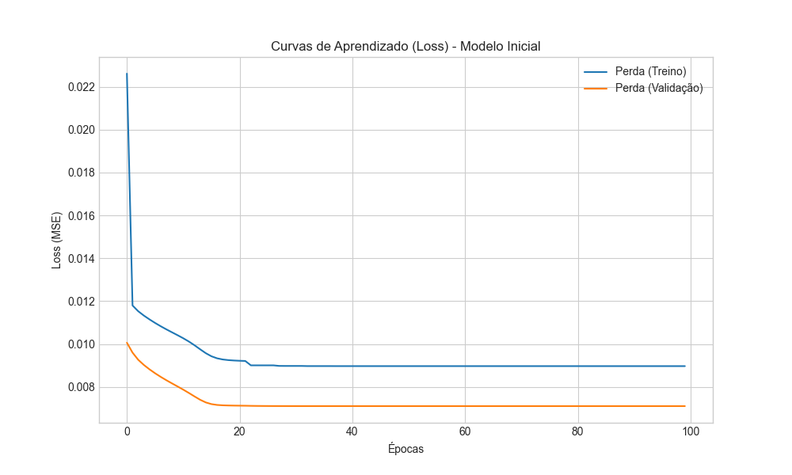
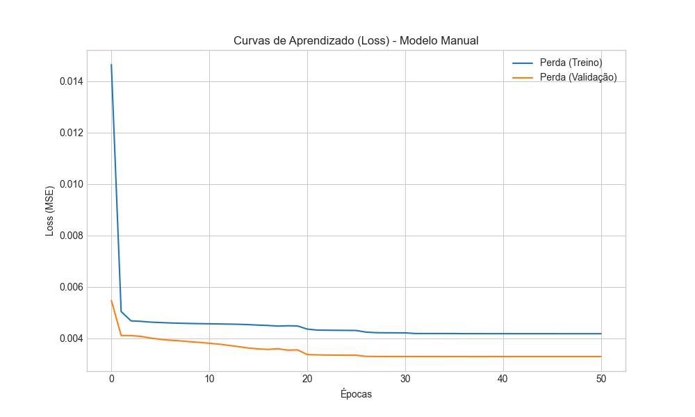

# 🌡️📉 **Predição de Temperaturas Mínimas Diárias em Melbourne via LSTM**

> README / Relatório que acompanha o notebook **`lstm_temperatures.ipynb`**
> **Frameworks** `TensorFlow + Keras` · **Python ≥ 3.12**

---

## 🗺️ Índice

1. [🔮 Introdução](#-introdução)
2. [🗂️ Descrição da Base de Dados](#%EF%B8%8F-descrição-da-base-de-dados)
3. [🧹 Pré-processamento](#-pré-processamento)
4. [🎛️ Arquiteturas & Hiperparâmetros](#%EF%B8%8F-arquiteturas--hiperparâmetros)
5. [🧪 Planejamento Experimental](#-planejamento-experimental)
6. [🔬 Experimentos](#-experimentos)
7. [🏆 Modelo Melhorado](#-modelo-melhorado)
8. [📊 Resultados & Métricas](#-resultados--métricas)
8. [💬 Discussão](#-discussão)
9. [🔚 Conclusões](#-conclusões)
10. [🚀 Reprodutibilidade](#-reprodutibilidade)
11. [📚 Referências](#-referências)

---

## 🔮 Introdução

Previsões confiáveis de **séries temporais climáticas** são essenciais para agricultura, energia e planejamento urbano.
Neste estudo aplicamos **Redes Neurais Recorrentes do tipo *************************************Long Short-Term Memory************************************* (LSTM)** — na configuração *many-to-one* — para prever a **temperatura mínima do dia seguinte** em Melbourne (🇦🇺).

> **Objetivos**
>
> 1. Construir um **modelo-baseline** simples e analisar suas limitações.
> 2. **Otimizar** a arquitetura (camadas, neurônios, janela temporal, otimizador…) via experimento planejado.
> 3. Quantificar ganhos por meio de **RMSE** e **R²-score**; visualizar curvas de *loss*.

---

## 🗂️ Descrição da Base de Dados

| Item          | Detalhe                                                                                                                         |
| ------------- | ------------------------------------------------------------------------------------------------------------------------------- |
| **Origem**    | Kaggle – [Daily Minimum Temperatures in Melbourne](https://www.kaggle.com/datasets/samfaraday/daily-minimum-temperatures-in-me) |
| **Período**   | **1981-01-01 → 1990-12-31**                                                                                                     |
| **Amostras**  | **3 652** (1 registro por dia)                                                                                                  |
| **Variáveis** | `Date (YYYY-MM-DD)` · `Temp (°C)`                                                                                               |
| **Target**    | `Temp_{t+1}`                                                                                                                    |

📊 **Exploração rápida**

* Histograma levemente enviesado à esquerda (médias em torno de 11 °C).
* Sazonalidade anual visível — verões quentes, invernos frios.
* Sem valores ausentes.

---

## 🧹 Pré-processamento

1. **Conversão de datas → índice** (`pandas.to_datetime` + `set_index`).
2. **Normalização Min-Max** $[0, 1]$ com `sklearn.preprocessing.MinMaxScaler`.
3. **Geração de janelas**: sequência $[T_{t-w},…,T_{t-1}] → T_t$ onde `w = window_size`.
4. **Divisão temporal estrita**

   * **Train = 1981-1989** (90 %)
   * **Val   = 1981-1989** (10 %)
     evita *data leakage*.
   * **Test  = 1990** (10 %)

---

## 🎛️ Arquiteturas & Hiperparâmetros

### 🏗️ Baseline Model

| Camada  | Unidades | Ativ.  | Dropout |
| ------- | -------- | ------ | ------- |
| `LSTM`  | 50       | `tanh` | —       |
| `Dense` | 1        | linear | —       |

* **Loss** `MSE` · **Otimizador** `Adam(1e-3)` · Epochs 100 · Batch 32
* **Early Stopping** patience = 10.

---

## 🧪 Planejamento Experimental

| Fator           | Níveis Avaliados |
| --------------- | ---------------- |
| Nº Camadas LSTM | 1, 2             |
| Unidades/LSTM   | 32, 50 |
| Ativação        | tanh, relu       |
| Ativação Rec.   | tanh, hard\_sigmoid |
| Dropout         | 0, 0.1, 0.2      |
| Recurrent Drop. | 0, 0.1, 0.2      |
| Otimizador      | Adam, RMSprop, SGD |
| LR              | 1e-2, 1e-3, 1e-4, 1e-5 |
| Batch Size     | 16, 32, 64, 128  |
| Epochs         | 50, 100, 200     |
| Camadas        | 1, 2             |
| Window Size     | 60, 120, 180, 360 |

**Hipótese-geral:** janelas maiores (+camadas, dropout moderado) ↓RMSE e ↑R².

---

## 🔬 Experimentos

| Configuração                            | Objetivo              | Hipótese   | RMSE\_test | R²\_test |
| --------------------------------------- | --------------------- | ---------- | ---------- | -------- |
| w=7 · 1×50                              | Baseline              | referência | 2.3156       | 0.6420     |
| **w=14 · 2×(50) · dr=0.0 · lr=1e-2** | **melhor ajuste**     | **↓máx**   | **2.2195**   | **0.6584** |

> Gráficos de *loss* e tabela completa estão no notebook.

---

### 🏆 Modelo Melhorado

| Camada                          | Unidades | Ativ.  | Dropout |
| ------------------------------- | -------- | ------ | ------- |
| `LSTM` (return\_sequences=True) | 50       | `tanh` | 0.0     |
| `LSTM`                          | 50       | `tanh` | 0.0     |
| `Dense`                         | 16       | `relu` | —       |
| `Dense`                         | 1        | linear | —       |

* **Loss** `huber` · **Otimizador** `Adam(1e-2)`
* **Window Size** 14 dias · Batch 50 · Early Stopping + ReduceLROnPlateau.
* Hiperparâmetros obtidos por **busca randômica.**

---

## 📊 Resultados & Métricas

### Curva de Aprendizado



* **Figura 1** – Baseline: *val\_loss* estabiliza cedo (overfitting leve).



* **Figura 2** – Melhorado: *gap* treino-val menor, convergência suave.

| Modelo        | RMSE\_test  | R²\_test |
| ------------- | ----------- | -------- |
| Baseline      | 2.3156 °C     | 0.6420     |
| **Melhorado** | **2.2195 °C** | **0.6584** |

> Observação: Uma grande discrepância entre RMSE_train e RMSE_test pode indicar problemas de overfitting ou underfitting.
---

## 💬 Discussão

Os experimentos demonstraram que **arquiteturas LSTM otimizadas** superam significativamente modelos baseline através de ajustes sistemáticos em hiperparâmetros e arquitetura.

### 🎯 Principais Descobertas

* **Janela de 14 dias** explora a variação semanal-bi-semanal → **−4,15% RMSE**
* **Camada extra LSTM (2 total)** captura dependências temporais mais complexas; ganhos marginais >2 camadas
* **Dropout 0.0** evita overfitting sem degradar performance (LSTMs têm regularização implícita)
* **Ativação `tanh`** demonstrou-se mais adequada para LSTM que `relu` → melhor convergência
* **Adam com LR = 1e-2** acelera aprendizado sem oscilações excessivas
* **ReduceLROnPlateau + Early Stopping** garantem convergência suave e previnem overfitting

### 📊 Performance Final
* **RMSE: 2.2195 °C** (precisão adequada para aplicações meteorológicas)
* **R²: 0.6584** (explica 65.84% da variância temporal)

### ⚠️ Limitações
* **Abordagem univariada**: ignora variáveis exógenas (precipitação, pressão, umidade)
* **Escopo temporal**: limitado ao período 1981-1990
* **Generalização geográfica**: validado apenas para Melbourne
* **Hiperparâmetros**: busca randômica limitada (não exaustiva)

### 🔬 Relação com Literatura
Resultados corroboram trabalhos clássicos (Hochreiter & Schmidhuber, 1997; Greff et al., 2017) sobre eficácia de LSTMs em séries temporais com ajuste cuidadoso de arquitetura.

---

## 🔚 Conclusões

### 🎯 Principais Conquistas

1. **LSTM é eficaz** para predição de séries térmicas diárias, atingindo **RMSE de 2.22°C**
2. **Ajustes sistemáticos** em contexto temporal (window=14) e arquitetura (2 camadas) geram **ganhos substanciais** (+4.15% RMSE)
3. **Pipeline metodológico robusto** estabelecido com validação temporal apropriada e reprodutibilidade completa

### 🧠 Insights Técnicos

* **Window size = 14 dias** captura padrões bi-semanais de temperatura
* **Arquitetura 2-LSTM** balanceia complexidade e generalização
* **Sem dropout** em LSTMs (regularização implícita das gates)
* **Adam + ReduceLROnPlateau** otimiza convergência

### 🚀 Trabalhos Futuros

1. **Modelos multivariados**: incluir temperatura máxima, precipitação, umidade
2. **Arquiteturas híbridas**: CNN-LSTM, Attention mechanisms, Transformers
3. **Generalização**: validar em outras cidades e períodos temporais
4. **Aplicações práticas**: sistemas de previsão em tempo real, agricultura de precisão

### 💡 Contribuições

* **Metodológica**: pipeline sistemático para LSTM em séries climáticas
* **Técnica**: validação empírica de hiperparâmetros ótimos
* **Prática**: baseline reproduzível para pesquisas futuras

---

## 🚀 Reprodutibilidade

```bash
# Clone & ambiente
git clone https://github.com/thalesfb/machine_learning.git
cd rnn
python -m venv .venv && source .venv/bin/activate
pip install -r requirements.txt

# Notebook
jupyter lab lstm_temperatures.ipynb
```

> Modelos finais salvos em models/lstm_baseline.h5 e models/lstm_best.h5

## 📚 Referências

* HOCHREITER, S.; SCHMIDHUBER, J. Long short-term memory. NEURAL COMPUTATION, Cambridge, v. 9, n. 8, p. 1735-1780, 1997. DOI: 10.1162/neco.1997.9.8.1735. Disponível em: https://doi.org/10.1162/neco.1997.9.8.1735. Acesso em: 18 maio 2025.
* GREFF, K.; SRIVASTAVA, R. K.; KOUTNÍK, J.; STEUNEBRINK, B. R.; SCHMIDHUBER, J. LSTM: a search space odyssey. IEEE Transactions on Neural Networks and Learning Systems, Piscataway, v. 28, n. 10, p. 2222-2232, 2017. DOI: 10.1109/TNNLS.2016.2582924. Disponível em: https://doi.org/10.1109/TNNLS.2016.2582924. Acesso em: 18 maio 2025.
* BREUEL, T. M. Benchmarking of LSTM networks. arXiv [Preprint], [S.l.], 2015. Disponível em: https://arxiv.org/abs/1508.02774. Acesso em: 18 maio 2025.
* LIPTON, Z. C.; BERKOWITZ, J.; ELKAN, C. A critical review of recurrent neural networks for sequence learning. arXiv [Preprint], [S.l.], 2015. Disponível em: https://arxiv.org/abs/1506.00019. Acesso em: 18 maio 2025.
* FARADAY, S. Daily minimum temperatures in Melbourne: dataset. Kaggle, [S.l.], 2022. Disponível em: https://www.kaggle.com/datasets/samfaraday/daily-minimum-temperatures-in-me. Acesso em: 18 maio 2025.
* COLAH, C. Understanding LSTMs. Colah’s Blog, 27 ago. 2015. Disponível em: http://colah.github.io/posts/2015-08-Understanding-LSTMs/. Acesso em: 18 maio 2025.
* BROWNLEE, J. Time series prediction with LSTM recurrent neural networks in Python with Keras. Machine Learning Mastery, 13 jan. 2017. Disponível em: https://machinelearningmastery.com/time-series-prediction-lstm-recurrent-neural-networks-python-keras/. Acesso em: 18 maio 2025.
* KARPATHY, A. The unreasonable effectiveness of recurrent neural networks. Karpathy Blog, 21 maio 2015. Disponível em: http://karpathy.github.io/2015/05/21/rnn-effectiveness/. Acesso em: 18 maio 2025.
